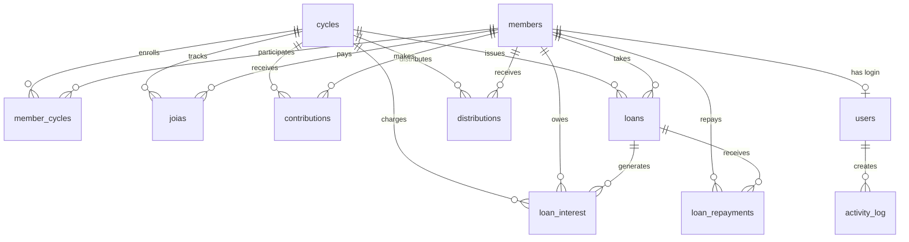

# ASCA Selecção — Sistema de Gestão de Poupança e Empréstimo

Sistema completo para gerir um grupo de poupança e empréstimo (ASCA — Accumulating Savings and Credit Association), construído com PHP 8.2+, MySQL/MariaDB, Bootstrap 5, jQuery/AJAX.

---

## Decisões Confirmadas

> [!NOTE]
> **Ciclos históricos**: O sistema suporta **múltiplos ciclos**. O utilizador pode navegar entre ciclos (ex: 2024-2025, 2025-2026) e consultar dados históricos. O ciclo activo é seleccionado via dropdown no sidebar.

> [!NOTE]
> **Autenticação com 3 roles**: `admin` (acesso total), `user` (operador), `member` (acesso apenas ao seu extracto pessoal). Cada membro terá login próprio vinculado ao seu registo de membro.

> [!NOTE]
> **Moeda**: Todos os valores são em MZN (Metical). O sistema não terá suporte multi-moeda.

---

## 1. KPIs Sugeridos para o Dashboard

| # | KPI | Descrição | Visualização |
|---|-----|-----------|--------------|
| 1 | **Total de Membros Activos** | Contagem de membros com status activo no ciclo | Card numérico |
| 2 | **Fundo Total Acumulado** | Soma de todas as mensalidades pagas no ciclo | Card com ícone de cofre |
| 3 | **Total Emprestado** | Soma de todos os empréstimos desembolsados no ciclo | Card com ícone de seta |
| 4 | **Total de Juros Cobrados** | Soma de juros recebidos (15% mensal sobre empréstimos) | Card com ícone de % |
| 5 | **Total de Multas** | Soma de multas por atraso de mensalidade (15%) | Card com ícone de alerta |
| 6 | **Taxa de Recuperação** | % de empréstimos pagos dentro do prazo vs. total | Gauge / Donut |
| 7 | **Empréstimos em Atraso** | Número e valor de empréstimos cuja data limite expirou | Card vermelho de alerta |
| 8 | **Membros sem Movimentação Mínima** | Membros que ainda não atingiram 50.000 MT emprestados | Lista / Badge |
| 9 | **Jóias Pendentes** | Membros que ainda não pagaram a jóia | Badge de alerta |
| 10 | **Distribuição de Juros Estimada** | Projecção de juros a distribuir por membro no fecho | Card informativo |
| 11 | **Capital Disponível para Empréstimo** | Fundo total − empréstimos activos | Card verde |
| 12 | **Gráfico: Entradas vs Saídas (mensal)** | Evolução mensal de contribuições vs. empréstimos | Chart de barras |
| 13 | **Gráfico: Crescimento do Fundo** | Evolução acumulada do fundo ao longo dos meses | Chart de linha |
| 14 | **Próximos Vencimentos** | Empréstimos que vencem nos próximos 7 dias | Tabela resumo |

---

## 2. Composição da Interface (UI/UX)

### 2.1 Layout Geral

```
┌──────────────────────────────────────────────────┐
│  Top Navbar  (Logo · Notificações · Perfil)      │
├────────┬─────────────────────────────────────────┤
│        │                                         │
│  Side  │        Main Content Area                │
│  bar   │                                         │
│        │                                         │
│  Menu  │  ┌─────────────────────────────────┐    │
│        │  │  Page Header + Quick Actions    │    │
│        │  ├─────────────────────────────────┤    │
│        │  │  KPI Cards / Tables / Forms     │    │
│        │  └─────────────────────────────────┘    │
│        │                                         │
├────────┴─────────────────────────────────────────┤
│  Footer  (© ASCA Selecção · Versão)              │
└──────────────────────────────────────────────────┘
```

### 2.2 Menu Lateral (Sidebar)

**Selector de ciclo** no topo do sidebar (dropdown). Todos os dados filtram pelo ciclo seleccionado.

**Menu Admin/User:**

| Ícone | Item | Destino |
|-------|------|---------|
| 🏠 | Dashboard | `dashboard.php` |
| 👥 | Membros | `membros.php` |
| 💰 | Contribuições | `contribuicoes.php` |
| 🏦 | Empréstimos | `emprestimos.php` |
| 📊 | Relatórios | `relatorios.php` |
| ⚙️ | Definições | `definicoes.php` |

**Menu Membro (self-service):**

| Ícone | Item | Destino |
|-------|------|---------|
| 🏠 | Meu Resumo | `meu_resumo.php` |
| 💰 | Minhas Contribuições | `minhas_contribuicoes.php` |
| 🏦 | Meus Empréstimos | `meus_emprestimos.php` |
| 📄 | Meu Extracto | `meu_extracto.php` |

### 2.3 Botões de Acção Gerais (por página)

| Página | Botões Principais |
|--------|-------------------|
| **Dashboard** | Actualizar Dados · Exportar Resumo PDF |
| **Membros** | ➕ Novo Membro · 📥 Importar · 📤 Exportar CSV |
| **Contribuições** | ➕ Registar Pagamento · 📋 Ver Pendentes |
| **Empréstimos** | ➕ Novo Empréstimo · 📋 Empréstimos Activos · ⚠️ Em Atraso |
| **Relatórios** | Gerar Extracto · Relatório Mensal · Fecho de Ciclo |

### 2.4 Botões de Acção Rápida (Quick Actions no Dashboard)

Apresentados como cards clicáveis no topo do Dashboard:

1. **➕ Registar Pagamento** → Modal AJAX para registar mensalidade
2. **🏦 Novo Empréstimo** → Modal AJAX para desembolsar empréstimo
3. **💳 Registar Reembolso** → Modal AJAX para receber reembolso de empréstimo
4. **📄 Gerar Extracto** → Seleccionar membro e gerar PDF

### 2.5 Elementos Cruciais

- **Alertas no topo**: Empréstimos vencidos, membros sem jóia, mensalidades pendentes
- **Tabelas com DataTables**: Pesquisa, ordenação, paginação, export
- **Modais AJAX**: Formulários de inserção/edição sem reload
- **Toasts/Notificações**: Confirmação de acções em tempo real
- **Breadcrumbs**: Navegação contextual
- **Badges de Status**: Activo/Inactivo, Pago/Pendente/Em Atraso
- **Tooltips**: Explicação das regras do grupo em campos relevantes

---

## 3. Estrutura do Projeto

```
c:\Projectos\ASCA Seleccao\
├── config/
│   ├── database.php            # Conexão PDO
│   ├── constants.php           # Constantes do sistema
│   ├── session.php             # Gestão de sessão
│   └── migrate.php             # Script de migração DB (11 tabelas)
├── includes/
│   ├── header.php              # Head HTML + Navbar
│   ├── sidebar.php             # Menu lateral + selector de ciclo
│   ├── footer.php              # Footer + scripts
│   └── functions.php           # Funções auxiliares globais
├── assets/
│   ├── css/
│   │   └── style.css           # Estilos customizados
│   ├── js/
│   │   ├── app.js              # Lógica global JS
│   │   ├── membros.js          # AJAX membros
│   │   ├── contribuicoes.js    # AJAX contribuições
│   │   ├── emprestimos.js      # AJAX empréstimos
│   │   └── dashboard.js        # Gráficos + KPIs
│   └── img/
│       └── logo.png
├── pages/
│   ├── dashboard.php           # Dashboard com KPIs (admin/user)
│   ├── membros.php             # Gestão de membros
│   ├── contribuicoes.php       # Gestão de contribuições
│   ├── emprestimos.php         # Gestão de empréstimos
│   ├── relatorios.php          # Relatórios e exportação
│   ├── definicoes.php          # Configurações + gestão de ciclos
│   └── member/                 # Portal do membro (role=member)
│       ├── meu_resumo.php      # Dashboard pessoal
│       ├── minhas_contribuicoes.php  # Histórico de mensalidades
│       ├── meus_emprestimos.php     # Histórico de empréstimos
│       └── meu_extracto.php    # Extracto + download PDF
├── api/
│   ├── membros_api.php         # CRUD AJAX membros
│   ├── contribuicoes_api.php   # CRUD AJAX contribuições
│   ├── emprestimos_api.php     # CRUD AJAX empréstimos
│   ├── dashboard_api.php       # Dados para KPIs/gráficos
│   └── relatorios_api.php      # Geração de PDF
├── services/
│   ├── MemberService.php       # Lógica de negócio: membros
│   ├── ContributionService.php # Lógica de negócio: contribuições
│   ├── LoanService.php         # Lógica de negócio: empréstimos
│   ├── PenaltyService.php      # Cálculo de multas e juros
│   ├── ReportService.php       # Geração de relatórios
│   └── NotificationService.php # Emails (PHPMailer)
├── templates/
│   └── pdf/
│       ├── extracto.php        # Template PDF extracto
│       ├── relatorio_mensal.php# Template relatório mensal
│       └── fecho_ciclo.php     # Template fecho de ciclo
├── vendor/                     # Composer autoload
├── composer.json
├── index.php                   # Entry point (redirect)
├── login.php                   # Formulário de login (3 roles)
├── logout.php                  # Logout
└── .htaccess                   # URL rewrite + segurança
```

---

## 4. Esquema da Base de Dados

### 4.1 Tabela `users` — Utilizadores do Sistema

```sql
CREATE TABLE users (
    id          INT AUTO_INCREMENT PRIMARY KEY,
    username    VARCHAR(50)  NOT NULL UNIQUE,
    password    VARCHAR(255) NOT NULL,  -- password_hash()
    full_name   VARCHAR(150) NOT NULL,
    email       VARCHAR(150) NULL,
    role        ENUM('admin','user','member') DEFAULT 'user',
    member_id   INT          NULL,      -- FK para members (quando role='member')
    is_active   TINYINT(1)   DEFAULT 1,
    created_at  DATETIME     DEFAULT CURRENT_TIMESTAMP,
    updated_at  DATETIME     DEFAULT CURRENT_TIMESTAMP ON UPDATE CURRENT_TIMESTAMP,
    FOREIGN KEY (member_id) REFERENCES members(id) ON DELETE SET NULL
);
```

> Quando `role='member'`, o `member_id` vincula ao registo do membro. O login é criado automaticamente ao registar um novo membro.

---

### 4.2 Tabela `cycles` — Ciclos Anuais

```sql
CREATE TABLE cycles (
    id          INT AUTO_INCREMENT PRIMARY KEY,
    name        VARCHAR(50)  NOT NULL,          -- Ex: "Ciclo 2025-2026"
    start_date  DATE         NOT NULL,          -- 2025-12-01
    end_date    DATE         NOT NULL,          -- 2026-11-30
    joia_amount DECIMAL(12,2) NOT NULL DEFAULT 1000.00,
    joia_deadline DATE       NOT NULL,          -- 2025-12-30
    min_monthly DECIMAL(12,2) NOT NULL DEFAULT 2000.00,
    max_monthly DECIMAL(12,2) NOT NULL DEFAULT 5000.00,
    monthly_deadline_day INT NOT NULL DEFAULT 10, -- Dia do mês seguinte
    late_fee_pct DECIMAL(5,2) NOT NULL DEFAULT 15.00, -- 15%
    loan_interest_pct DECIMAL(5,2) NOT NULL DEFAULT 15.00, -- 15% mensal
    loan_repayment_days INT NOT NULL DEFAULT 30,
    min_loan_movement DECIMAL(12,2) NOT NULL DEFAULT 50000.00,
    fixed_interest_entitlement DECIMAL(12,2) NOT NULL DEFAULT 7500.00,
    is_active   TINYINT(1)   DEFAULT 1,
    created_at  DATETIME     DEFAULT CURRENT_TIMESTAMP
);
```

---

### 4.3 Tabela `members` — Membros do Grupo

```sql
CREATE TABLE members (
    id              INT AUTO_INCREMENT PRIMARY KEY,
    full_name       VARCHAR(200) NOT NULL,
    phone           VARCHAR(20)  NULL,
    email           VARCHAR(150) NULL,
    id_number       VARCHAR(50)  NULL,            -- BI / NUIT
    address         VARCHAR(300) NULL,
    join_date       DATE         NOT NULL,
    status          ENUM('active','inactive','suspended') DEFAULT 'active',
    notes           TEXT         NULL,
    created_at      DATETIME     DEFAULT CURRENT_TIMESTAMP,
    updated_at      DATETIME     DEFAULT CURRENT_TIMESTAMP ON UPDATE CURRENT_TIMESTAMP
);
```

> Os membros existem independentemente dos ciclos. A associação membro↔ciclo é feita pela tabela `member_cycles`.

---

### 4.3b Tabela `member_cycles` — Inscrição de Membros por Ciclo

```sql
CREATE TABLE member_cycles (
    id          INT AUTO_INCREMENT PRIMARY KEY,
    member_id   INT NOT NULL,
    cycle_id    INT NOT NULL,
    enrolled_at DATE NOT NULL,
    status      ENUM('active','inactive') DEFAULT 'active',
    created_at  DATETIME DEFAULT CURRENT_TIMESTAMP,
    FOREIGN KEY (member_id) REFERENCES members(id),
    FOREIGN KEY (cycle_id)  REFERENCES cycles(id),
    UNIQUE KEY unique_enrollment (member_id, cycle_id)
);
```

> Permite que o mesmo membro participe em múltiplos ciclos. Ao criar um novo ciclo, podem-se inscrever membros existentes ou novos.

---

### 4.4 Tabela `joias` — Pagamento da Jóia (Taxa de Adesão)

```sql
CREATE TABLE joias (
    id          INT AUTO_INCREMENT PRIMARY KEY,
    member_id   INT NOT NULL,
    cycle_id    INT NOT NULL,
    amount      DECIMAL(12,2) NOT NULL DEFAULT 1000.00,
    paid_date   DATE         NULL,
    status      ENUM('pending','paid') DEFAULT 'pending',
    receipt_ref VARCHAR(50)  NULL,               -- Referência do comprovativo
    notes       TEXT         NULL,
    created_at  DATETIME     DEFAULT CURRENT_TIMESTAMP,
    FOREIGN KEY (member_id) REFERENCES members(id),
    FOREIGN KEY (cycle_id)  REFERENCES cycles(id),
    UNIQUE KEY unique_joia (member_id, cycle_id)
);
```

---

### 4.5 Tabela `contributions` — Mensalidades / Contribuições

```sql
CREATE TABLE contributions (
    id              INT AUTO_INCREMENT PRIMARY KEY,
    member_id       INT NOT NULL,
    cycle_id        INT NOT NULL,
    reference_month DATE NOT NULL,               -- Mês de referência (1º dia do mês)
    amount          DECIMAL(12,2) NOT NULL,       -- Valor pago (2000-5000)
    paid_date       DATE         NOT NULL,        -- Data efectiva do pagamento
    due_date        DATE         NOT NULL,        -- Data limite (dia 10 mês seguinte)
    is_late         TINYINT(1)   DEFAULT 0,       -- Pago fora do prazo?
    late_fee        DECIMAL(12,2) DEFAULT 0.00,   -- Multa calculada (15% do valor)
    payment_method  ENUM('cash','mpesa','bank_transfer') DEFAULT 'cash',
    receipt_ref     VARCHAR(50)  NULL,
    notes           TEXT         NULL,
    created_at      DATETIME     DEFAULT CURRENT_TIMESTAMP,
    FOREIGN KEY (member_id) REFERENCES members(id),
    FOREIGN KEY (cycle_id)  REFERENCES cycles(id)
);
```

---

### 4.6 Tabela `loans` — Empréstimos

```sql
CREATE TABLE loans (
    id              INT AUTO_INCREMENT PRIMARY KEY,
    member_id       INT NOT NULL,
    cycle_id        INT NOT NULL,
    amount          DECIMAL(12,2) NOT NULL,       -- Valor emprestado
    disbursement_date DATE NOT NULL,              -- Data de desembolso
    due_date        DATE NOT NULL,                -- Data limite para reembolso (+30 dias)
    status          ENUM('active','paid','overdue','defaulted') DEFAULT 'active',
    notes           TEXT NULL,
    created_at      DATETIME     DEFAULT CURRENT_TIMESTAMP,
    updated_at      DATETIME     DEFAULT CURRENT_TIMESTAMP ON UPDATE CURRENT_TIMESTAMP,
    FOREIGN KEY (member_id) REFERENCES members(id),
    FOREIGN KEY (cycle_id)  REFERENCES cycles(id)
);
```

---

### 4.7 Tabela `loan_interest` — Juros Mensais dos Empréstimos

```sql
CREATE TABLE loan_interest (
    id          INT AUTO_INCREMENT PRIMARY KEY,
    loan_id     INT NOT NULL,
    member_id   INT NOT NULL,
    cycle_id    INT NOT NULL,
    reference_month DATE NOT NULL,                -- Mês de cobrança do juro
    interest_rate   DECIMAL(5,2) NOT NULL DEFAULT 15.00,
    interest_amount DECIMAL(12,2) NOT NULL,       -- 15% do valor emprestado
    paid_date   DATE         NULL,
    status      ENUM('pending','paid') DEFAULT 'pending',
    notes       TEXT         NULL,
    created_at  DATETIME     DEFAULT CURRENT_TIMESTAMP,
    FOREIGN KEY (loan_id)   REFERENCES loans(id),
    FOREIGN KEY (member_id) REFERENCES members(id),
    FOREIGN KEY (cycle_id)  REFERENCES cycles(id)
);
```

---

### 4.8 Tabela `loan_repayments` — Reembolsos de Empréstimos

```sql
CREATE TABLE loan_repayments (
    id          INT AUTO_INCREMENT PRIMARY KEY,
    loan_id     INT NOT NULL,
    member_id   INT NOT NULL,
    amount      DECIMAL(12,2) NOT NULL,           -- Valor reembolsado (capital)
    paid_date   DATE         NOT NULL,
    payment_method ENUM('cash','mpesa','bank_transfer') DEFAULT 'cash',
    receipt_ref VARCHAR(50)  NULL,
    notes       TEXT         NULL,
    created_at  DATETIME     DEFAULT CURRENT_TIMESTAMP,
    FOREIGN KEY (loan_id)   REFERENCES loans(id),
    FOREIGN KEY (member_id) REFERENCES members(id)
);
```

---

### 4.9 Tabela `distributions` — Distribuição de Juros/Multas no Fecho

```sql
CREATE TABLE distributions (
    id              INT AUTO_INCREMENT PRIMARY KEY,
    cycle_id        INT NOT NULL,
    member_id       INT NOT NULL,
    type            ENUM('interest','late_fee','surplus') NOT NULL,
    amount          DECIMAL(12,2) NOT NULL,
    description     TEXT NULL,
    distributed_at  DATE NOT NULL,
    created_at      DATETIME DEFAULT CURRENT_TIMESTAMP,
    FOREIGN KEY (cycle_id)  REFERENCES cycles(id),
    FOREIGN KEY (member_id) REFERENCES members(id)
);
```

---

### 4.10 Tabela `activity_log` — Registo de Actividades

```sql
CREATE TABLE activity_log (
    id          INT AUTO_INCREMENT PRIMARY KEY,
    user_id     INT NULL,
    action      VARCHAR(100) NOT NULL,            -- Ex: 'loan_created', 'payment_received'
    entity_type VARCHAR(50)  NULL,                -- Ex: 'loan', 'contribution', 'member'
    entity_id   INT          NULL,
    description TEXT         NULL,
    ip_address  VARCHAR(45)  NULL,
    created_at  DATETIME     DEFAULT CURRENT_TIMESTAMP,
    FOREIGN KEY (user_id) REFERENCES users(id)
);
```

---

### 4.12 Diagrama de Relações



---

## 5. Regras de Negócio Implementadas

### 5.1 Jóia (Regras 1-2)
- Cada membro deve pagar **1.000 MT** até **30/12** do ano anterior ao ciclo.
- Sistema bloqueia acesso a empréstimos se jóia não estiver paga.
- Alerta no dashboard para jóias pendentes.

### 5.2 Mensalidades (Regras 3-5, 10)
- Mínimo: **2.000 MT** / Máximo: **5.000 MT** por mês.
- Prazo: até dia **10 do mês seguinte**.
- Se `paid_date > due_date` → `is_late = 1` → `late_fee = amount × 15%`.
- Multas são distribuídas pelo grupo no fecho do ciclo.
- Ciclo: Dezembro 2025 a Novembro 2026 (12 mensalidades).

### 5.3 Empréstimos (Regras 6-9, 11-12)
- Apenas membros com jóia paga podem pedir empréstimos.
- Movimentação mínima obrigatória: **50.000 MT** durante o ano (pode ser em parcelas).
- Se não atingir 50.000 → sem direito a juros fixos de **7.500 MT**.
- Juros de **15%** cobrados **mensalmente** sobre o valor emprestado.
- Prazo de reembolso: **30 dias** sem excepção.
- Se o capital ultrapassa 30 dias → novo juro de 15% incide no dia seguinte.
- Se juros totais arrecadados > total de juros fixos (7.500 × nº membros elegíveis), o excedente é redistribuído.

### 5.4 Fecho de Ciclo
- Devolução do capital poupado de cada membro.
- Distribuição dos juros fixos (7.500 MT a elegíveis).
- Distribuição de multas proporcionalmente.
- Distribuição de excedente de juros proporcionalmente.

---

## 6. Relatórios e Exportações

| Relatório | Formato | Descrição |
|-----------|---------|-----------|
| **Extracto do Membro** | PDF | Detalha contribuições, empréstimos, juros e saldo de um membro |
| **Relatório Mensal** | PDF | Resumo de entradas, saídas, juros e multas do mês |
| **Relatório de Empréstimos Activos** | PDF / Ecrã | Lista de empréstimos activos com prazos e status |
| **Relatório de Atrasos** | PDF / Ecrã | Membros em atraso (mensalidades e empréstimos) |
| **Relatório de Fecho de Ciclo** | PDF | Resumo final com distribuição de capital, juros e multas |
| **Exportação de Dados** | CSV | Membros, contribuições, empréstimos (para backup/análise) |

---

## 7. Dependências (Composer)

```json
{
    "name": "asca/seleccao",
    "description": "Sistema de Gestão de Poupança e Empréstimo",
    "require": {
        "php": ">=8.2",
        "phpmailer/phpmailer": "^6.9",
        "dompdf/dompdf": "^2.0"
    },
    "autoload": {
        "psr-4": {
            "App\\": "services/"
        }
    }
}
```

---

## 8. Proposed Changes

### Core Infrastructure

#### [NEW] [database.php](file:///c:/Projectos/ASCA%20Seleccao/config/database.php)
Conexão PDO com MySQL/MariaDB, singleton pattern.

#### [NEW] [constants.php](file:///c:/Projectos/ASCA%20Seleccao/config/constants.php)
Constantes globais: nome do sistema, versão, timezone, moeda.

#### [NEW] [session.php](file:///c:/Projectos/ASCA%20Seleccao/config/session.php)
Gestão de sessão, verificação de autenticação.

#### [NEW] [migrate.php](file:///c:/Projectos/ASCA%20Seleccao/config/migrate.php)
Script para criar/actualizar todas as tabelas da base de dados.

---

### UI Components

#### [NEW] [header.php](file:///c:/Projectos/ASCA%20Seleccao/includes/header.php)
HTML head, navbar superior com logo, notificações e dropdown de perfil.

#### [NEW] [sidebar.php](file:///c:/Projectos/ASCA%20Seleccao/includes/sidebar.php)
Menu lateral responsivo com ícones Bootstrap Icons.

#### [NEW] [footer.php](file:///c:/Projectos/ASCA%20Seleccao/includes/footer.php)
Footer, inclusão de scripts JS, Bootstrap, DataTables, Chart.js.

#### [NEW] [functions.php](file:///c:/Projectos/ASCA%20Seleccao/includes/functions.php)
Funções auxiliares: formatação de moeda, datas, validações, redirect, flash messages.

---

### Pages (Admin/User)

#### [NEW] [login.php](file:///c:/Projectos/ASCA%20Seleccao/login.php)
Formulário de login com design moderno, validação, protecção CSRF. Redireciona para dashboard (admin/user) ou portal (member) conforme a role.

#### [NEW] [dashboard.php](file:///c:/Projectos/ASCA%20Seleccao/pages/dashboard.php)
Dashboard com 14 KPIs, gráficos Chart.js, quick actions, alertas. Filtrado pelo ciclo seleccionado.

#### [NEW] [membros.php](file:///c:/Projectos/ASCA%20Seleccao/pages/membros.php)
Tabela DataTables de membros, modal AJAX para criar/editar, perfil detalhado. Ao criar membro, gera automaticamente um user com role `member`.

#### [NEW] [contribuicoes.php](file:///c:/Projectos/ASCA%20Seleccao/pages/contribuicoes.php)
Gestão de mensalidades, detecção automática de atraso, cálculo de multa.

#### [NEW] [emprestimos.php](file:///c:/Projectos/ASCA%20Seleccao/pages/emprestimos.php)
Gestão de empréstimos, cálculo de juros, tracking de reembolsos, alertas de vencimento.

#### [NEW] [relatorios.php](file:///c:/Projectos/ASCA%20Seleccao/pages/relatorios.php)
Interface para gerar todos os relatórios PDF, filtros por membro/período.

#### [NEW] [definicoes.php](file:///c:/Projectos/ASCA%20Seleccao/pages/definicoes.php)
Configurações do ciclo, gestão de utilizadores, gestão de ciclos (criar/editar/fechar), parâmetros do grupo.

---

### Pages (Portal do Membro — role `member`)

#### [NEW] [meu_resumo.php](file:///c:/Projectos/ASCA%20Seleccao/pages/member/meu_resumo.php)
Dashboard pessoal do membro: total poupado, empréstimos activos, juros pagos, status da jóia, movimentação acumulada vs. 50.000 MT.

#### [NEW] [minhas_contribuicoes.php](file:///c:/Projectos/ASCA%20Seleccao/pages/member/minhas_contribuicoes.php)
Lista read-only de todas as mensalidades pagas pelo membro, com indicação de multas.

#### [NEW] [meus_emprestimos.php](file:///c:/Projectos/ASCA%20Seleccao/pages/member/meus_emprestimos.php)
Lista read-only de empréstimos do membro, com juros e status de reembolso.

#### [NEW] [meu_extracto.php](file:///c:/Projectos/ASCA%20Seleccao/pages/member/meu_extracto.php)
Extracto completo do membro com opção de download PDF.

---

### API Endpoints (AJAX)

#### [NEW] [membros_api.php](file:///c:/Projectos/ASCA%20Seleccao/api/membros_api.php)
CRUD completo de membros via AJAX (list, create, read, update, delete).

#### [NEW] [contribuicoes_api.php](file:///c:/Projectos/ASCA%20Seleccao/api/contribuicoes_api.php)
Registar e listar contribuições, cálculo automático de multas.

#### [NEW] [emprestimos_api.php](file:///c:/Projectos/ASCA%20Seleccao/api/emprestimos_api.php)
Criar empréstimo, registar reembolso, cobrar juros, listar activos/vencidos.

#### [NEW] [dashboard_api.php](file:///c:/Projectos/ASCA%20Seleccao/api/dashboard_api.php)
Retorna JSON com todos os KPIs e dados para gráficos.

#### [NEW] [relatorios_api.php](file:///c:/Projectos/ASCA%20Seleccao/api/relatorios_api.php)
Gera PDFs usando DomPDF, retorna link download.

---

### Services (Business Logic)

#### [NEW] [MemberService.php](file:///c:/Projectos/ASCA%20Seleccao/services/MemberService.php)
Lógica de negócio para membros: validação, verificação de jóia, elegibilidade.

#### [NEW] [ContributionService.php](file:///c:/Projectos/ASCA%20Seleccao/services/ContributionService.php)
Lógica de contribuições: validação de montante (2000-5000), detecção de atraso, cálculo de multa.

#### [NEW] [LoanService.php](file:///c:/Projectos/ASCA%20Seleccao/services/LoanService.php)
Lógica de empréstimos: verificação de elegibilidade, cálculo de juros 15%, gestão de vencimentos.

#### [NEW] [PenaltyService.php](file:///c:/Projectos/ASCA%20Seleccao/services/PenaltyService.php)
Cálculo de multas por atraso e juros sobre empréstimos vencidos.

#### [NEW] [ReportService.php](file:///c:/Projectos/ASCA%20Seleccao/services/ReportService.php)
Geração de relatórios e extractos PDF com DomPDF.

#### [NEW] [NotificationService.php](file:///c:/Projectos/ASCA%20Seleccao/services/NotificationService.php)
Envio de emails via PHPMailer (lembretes de pagamento, alertas de vencimento).

---

### Assets

#### [NEW] [style.css](file:///c:/Projectos/ASCA%20Seleccao/assets/css/style.css)
Design system customizado sobre Bootstrap 5: cores, cards, badges, sidebar responsivo.

#### [NEW] [app.js](file:///c:/Projectos/ASCA%20Seleccao/assets/js/app.js)
Lógica global JS: inicialização, notificações toast, confirmações, CSRF token.

#### [NEW] [membros.js](file:///c:/Projectos/ASCA%20Seleccao/assets/js/membros.js)
AJAX para CRUD de membros, datatable init, modais.

#### [NEW] [contribuicoes.js](file:///c:/Projectos/ASCA%20Seleccao/assets/js/contribuicoes.js)
AJAX para registo de contribuições, validação de valores, cálculo de multa live.

#### [NEW] [emprestimos.js](file:///c:/Projectos/ASCA%20Seleccao/assets/js/emprestimos.js)
AJAX para empréstimos, reembolsos, cálculo de juros live.

#### [NEW] [dashboard.js](file:///c:/Projectos/ASCA%20Seleccao/assets/js/dashboard.js)
Inicialização de Chart.js, atualização de KPIs via AJAX.

---

### Filter Implementation

#### [MODIFY] [contribuicoes.php](file:///c:/xampp/htdocs/ASCA%20Seleccao/pages/contribuicoes.php)
- Add a filter bar with "Mês" (Month) and "Membro" (Member) dropdowns.

#### [MODIFY] [contribuicoes.js](file:///c:/xampp/htdocs/ASCA%20Seleccao/assets/js/contribuicoes.js)
- Implement client-side filtering logic for the grouped contributions list.

#### [MODIFY] [emprestimos.php](file:///c:/xampp/htdocs/ASCA%20Seleccao/pages/emprestimos.php)
- Add a filter bar with "Mês" (Disbursement Month) and "Membro" (Member) dropdowns.

#### [MODIFY] [emprestimos.js](file:///c:/xampp/htdocs/ASCA%20Seleccao/assets/js/emprestimos.js)
- Implement client-side or server-side filtering for loans.

---

## 9. Verification Plan

### Automated Tests
1. **Migração da base de dados**
   ```
   Abrir no browser: http://localhost/ASCA%20Seleccao/config/migrate.php
   Verificar que todas as 10 tabelas são criadas sem erros.
   ```
- Browser subagent to test filters on both pages.

2. **Validação de regras de negócio** (testes manuais via browser)
   - Tentar registar contribuição abaixo de 2.000 → deve ser rejeitado
   - Tentar registar contribuição acima de 5.000 → deve ser rejeitado
   - Registar contribuição após dia 10 → multa de 15% deve ser calculada automaticamente
   - Tentar criar empréstimo para membro sem jóia → deve ser bloqueado
   - Criar empréstimo e verificar cálculo de juros de 15%

### Manual Verification
- Verify that filtering by member correctly isolates their transactions.
- Verify that filtering by month correctly shows only transactions for that period.
1. **Fluxo completo**: Criar ciclo → Adicionar membro → Pagar jóia → Registar mensalidades (dentro e fora do prazo) → Pedir empréstimo → Pagar juros → Reembolsar → Verificar extracto PDF
2. **Dashboard**: Confirmar que todos os KPIs reflectem os dados inseridos
3. **Responsividade**: Testar em desktop e dispositivos móveis (Chrome DevTools)
4. **Relatórios PDF**: Gerar extracto de membro e relatório mensal, verificar formatação
5. **Deploy para cPanel**: Upload via Git ou FTP, configurar base de dados de produção
